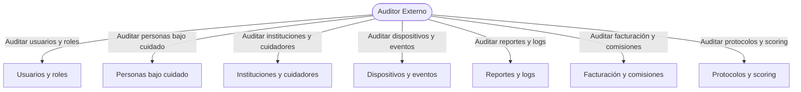

# Casos de Uso por Rol - Sistema Integral de Monitoreo y Cuidado

Este documento presenta los casos de uso principales del sistema, organizados por rol y visualizados en formato Mermaid (flowchart TD) para facilitar la comprensión y la comunicación entre equipos.

---

## 1. Persona Bajo Cuidado (Autocuidado y Dependiente)

```mermaid
flowchart TD
  PersonaBajoCuidado([Persona Bajo Cuidado])
  PersonaBajoCuidado -- "Ver/Editar perfil propio" --> PerfilPropio["Perfil propio"]
  PersonaBajoCuidado -- "Ver diagnóstico propio" --> DXPropio["Diagnóstico propio"]
  PersonaBajoCuidado -- "Ver medicación propia" --> MedPropia["Medicación propia"]
  PersonaBajoCuidado -- "Confirmar toma de medicación" --> ConfMed["Confirmar toma de medicación"]
  PersonaBajoCuidado -- "Ver alertas propias" --> AlertasPropias["Alertas propias"]
  PersonaBajoCuidado -- "Ver reportes propios" --> ReportesPropios["Reportes propios"]
  PersonaBajoCuidado -- "Ver eventos propios" --> EventosPropios["Eventos propios"]
  PersonaBajoCuidado -- "Ver dispositivos propios" --> DispositivosPropios["Dispositivos propios"]
  PersonaBajoCuidado -- "Ver protocolos de emergencia propios" --> ProtocolosEPropios["Protocolos de emergencia propios"]
  PersonaBajoCuidado -- "Ver recordatorios propios" --> RecordatoriosPropios["Recordatorios propios"]
  PersonaBajoCuidado -- "Ver geolocalización propia" --> GeolocPropia["Geolocalización propia"]
```

---

## 2. Familiar / Representante

```mermaid
flowchart TD
  Familiar([Familiar / Representante])
  Familiar -- "Ver/Editar perfil representado" --> PerfilRepresentado["Perfil representado"]
  Familiar -- "Ver diagnóstico representado" --> DXRepresentado["Diagnóstico representado"]
  Familiar -- "Ver medicación representado" --> MedRepresentado["Medicación representado"]
  Familiar -- "Ver/Editar recordatorios" --> RecordatoriosFam["Recordatorios"]
  Familiar -- "Recibir alertas de incidentes" --> AlertasFam["Alertas de incidentes"]
  Familiar -- "Ver reportes diarios" --> ReportesFam["Reportes diarios"]
  Familiar -- "Ver eventos representado" --> EventosFam["Eventos representado"]
  Familiar -- "Ver dispositivos representado" --> DispositivosFam["Dispositivos representado"]
  Familiar -- "Ver protocolos de emergencia" --> ProtocolosEFam["Protocolos de emergencia"]
  Familiar -- "Ver facturación y suscripciones" --> FacturacionFam["Facturación y suscripciones"]
  Familiar -- "Ver referidos y comisiones" --> ReferidosFam["Referidos y comisiones"]
```

---

## 3. Cuidador / Profesional

```mermaid
flowchart TD
  Cuidador([Cuidador / Profesional])
  Cuidador -- "Ver/Editar asignados" --> Asignados["Personas asignadas"]
  Cuidador -- "Registrar/Actualizar diagnóstico" --> RegDX["Registrar/Actualizar diagnóstico"]
  Cuidador -- "Registrar/Confirmar medicación" --> RegMed["Registrar/Confirmar medicación"]
  Cuidador -- "Registrar reportes diarios" --> RepDiario["Reportes diarios"]
  Cuidador -- "Registrar incidentes/caídas" --> Incidentes["Incidentes/caídas"]
  Cuidador -- "Configurar protocolos emergencia" --> ProtocolosC["Protocolos de emergencia"]
  Cuidador -- "Registrar observaciones de turno" --> ObsTurno["Observaciones de turno"]
  Cuidador -- "Configurar/Ver dispositivos" --> DispositivosC["Dispositivos"]
  Cuidador -- "Recibir/Confirmar alertas" --> AlertasC["Alertas"]
  Cuidador -- "Ver/Asesorar en paquetes y facturación" --> PaquetesC["Paquetes y facturación"]
  Cuidador -- "Ver scoring y reviews propios" --> ScoringC["Scoring y reviews"]
```

---

## 4. Institución

```mermaid
flowchart TD
  Institucion([Institución])
  Institucion -- "Ver/Editar personas bajo cuidado" --> PersonasInst["Personas bajo cuidado"]
  Institucion -- "Ver/Editar cuidadores" --> CuidadoresInst["Cuidadores"]
  Institucion -- "Ver/Editar dispositivos" --> DispositivosInst["Dispositivos"]
  Institucion -- "Ver/Editar eventos y alertas" --> EventosInst["Eventos y alertas"]
  Institucion -- "Configurar protocolos de emergencia y sujeción" --> ProtocolosInst["Protocolos"]
  Institucion -- "Ver/Editar reportes y auditoría" --> ReportesInst["Reportes y auditoría"]
  Institucion -- "Gestionar roles y permisos" --> RolesInst["Roles y permisos"]
  Institucion -- "Gestionar paquetes y facturación" --> PaquetesInst["Paquetes y facturación"]
  Institucion -- "Gestionar referidos y comisiones" --> ReferidosInst["Referidos y comisiones"]
  Institucion -- "Gestionar integración con sensores" --> SensoresInst["Integración con sensores"]
```

---

## 5. Administrador del Sistema

```mermaid
flowchart TD
  Admin([Administrador del Sistema])
  Admin -- "Crear/Editar/Eliminar usuarios" --> UsuariosAdmin["Usuarios"]
  Admin -- "Gestionar roles y permisos" --> RolesAdmin["Roles y permisos"]
  Admin -- "Gestionar entidades y relaciones" --> EntidadesAdmin["Entidades y relaciones"]
  Admin -- "Gestionar dispositivos y configuración" --> DispositivosAdmin["Dispositivos y configuración"]
  Admin -- "Gestionar paquetes y catálogo" --> PaquetesAdmin["Paquetes y catálogo"]
  Admin -- "Gestionar facturación y suscripciones" --> FacturacionAdmin["Facturación y suscripciones"]
  Admin -- "Gestionar referidos y comisiones" --> ReferidosAdmin["Referidos y comisiones"]
  Admin -- "Auditar logs y acciones" --> AuditoriaAdmin["Auditoría y logs"]
  Admin -- "Gestionar protocolos y recordatorios" --> ProtocolosAdmin["Protocolos y recordatorios"]
  Admin -- "Gestionar scoring y reviews" --> ScoringAdmin["Scoring y reviews"]
```

---

## 6. Auditor Externo

