# Diagramas UML - Sistema de Monitoreo Integral de Cuidado Humano

---

## Resumen Ejecutivo

Este documento presenta los diagramas UML esenciales para el sistema de monitoreo de cuidado humano, incluyendo casos de uso, clases, componentes, secuencia y despliegue. Estos diagramas complementan el DER y proporcionan una visión completa de la arquitectura del sistema.

---

## 1. Diagrama de Casos de Uso

### 1.1 Actores Principales
- **Persona Bajo Cuidado**: Usuario que recibe monitoreo y cuidado
- **Familiar/Cuidador**: Familiar o cuidador profesional
- **Administrador de Centro**: Gestor de institución de cuidado
- **Personal de Salud**: Médicos, enfermeros, terapistas
- **Sistema IoT**: Dispositivos y sensores
- **Servicios Externos**: Emergencias, proveedores de salud

### 1.2 Casos de Uso Principales

#### Gestión de Usuarios y Cuidado
```
Persona Bajo Cuidado:
├── Registrar perfil de cuidado
├── Configurar preferencias de accesibilidad
├── Activar botón de pánico
└── Ver reportes de actividad

Familiar/Cuidador:
├── Gestionar persona bajo cuidado
├── Configurar protocolos de emergencia
├── Recibir alertas y notificaciones
├── Ver video en vivo
├── Configurar geofences
└── Generar reportes

Administrador de Centro:
├── Gestionar personal del centro
├── Configurar protocolos institucionales
├── Monitorear múltiples usuarios
├── Generar reportes institucionales
├── Gestionar dispositivos del centro
└── Configurar horarios y turnos
```

#### Monitoreo y Alertas
```
Sistema IoT:
├── Detectar eventos (caída, convulsión, deambulación)
├── Enviar datos de ubicación
├── Reportar estado de dispositivos
└── Transmitir video

Sistema de Alertas:
├── Procesar eventos según protocolos
├── Escalar alertas automáticamente
├── Enviar notificaciones multi-canal
└── Registrar historial de alertas

Servicios Externos:
├── Recibir llamadas de emergencia
├── Procesar datos médicos
└── Integrar con sistemas de salud
```

#### Configuración y Administración
```
Personal de Salud:
├── Configurar protocolos médicos
├── Revisar reportes de salud
├── Ajustar medicamentos
└── Coordinar con cuidadores

Sistema de Soporte:
├── Proporcionar asistencia técnica
├── Capacitar usuarios
├── Mantener dispositivos
└── Actualizar configuraciones
```

---

## 2. Diagrama de Clases

### 2.1 Clases Principales

```mermaid
classDiagram
    class User {
        +UUID id
        +String email
        +String phone
        +String first_name
        +String last_name
        +Date date_of_birth
        +Boolean is_active
        +DateTime created_at
        +DateTime updated_at
        +authenticate()
        +hasRole(role)
        +getPermissions()
    }

    class Role {
        +UUID id
        +String name
        +String description
        +JSONB permissions
        +getPermissions()
        +hasPermission(permission)
    }

    class CaredPerson {
        +UUID id
        +UUID user_id
        +String care_type
        +String disability_type
        +JSONB medical_conditions
        +JSONB medications
        +JSONB emergency_contacts
        +JSONB care_preferences
        +JSONB accessibility_needs
        +JSONB guardian_info
        +Boolean is_self_care
        +getCaregivers()
        +getDevices()
        +getProtocols()
    }

    class Institution {
        +UUID id
        +String name
        +String institution_type
        +String address
        +String phone
        +String email
        +Integer capacity
        +Integer current_occupancy
        +Integer staff_count
        +JSONB services_offered
        +JSONB operating_hours
        +JSONB emergency_protocols
        +Boolean is_active
        +getUsers()
        +getServices()
        +getDevices()
    }

    class Service {
        +UUID id
        +String name
        +String service_type
        +String description
        +Decimal price_monthly
        +JSONB features
        +Integer device_limit
        +Integer user_limit
        +Integer storage_limit_gb
        +Boolean is_active
        +isWithinLimits()
        +getFeatures()
    }

    class Device {
        +UUID id
        +String device_id
        +String name
        +String device_type
        +String model
        +String manufacturer
        +String firmware_version
        +JSONB config
        +String location
        +Integer battery_level
        +DateTime last_maintenance
        +DateTime warranty_expiry
        +JSONB accessibility_features
        +Boolean is_active
        +sendCommand(command)
        +getStatus()
        +updateFirmware()
    }

    class Protocol {
        +UUID id
        +String name
        +String protocol_type
        +String description
        +JSONB contact_sequence
        +JSONB escalation_times
        +JSONB automatic_actions
        +Boolean is_active
        +UUID created_by
        +execute(event)
        +escalate(level)
    }

    class Event {
        +UUID id
        +String event_type
        +String severity
        +String device_id
        +UUID cared_person_id
        +JSONB location_data
        +JSONB sensor_data
        +DateTime timestamp
        +Boolean processed
        +String notes
        +process()
        +generateAlerts()
    }

    class Alert {
        +UUID id
        +UUID event_id
        +String alert_type
        +String severity
        +String status
        +JSONB recipients
        +DateTime sent_at
        +DateTime acknowledged_at
        +DateTime resolved_at
        +Integer escalation_level
        +send()
        +acknowledge()
        +resolve()
        +escalate()
    }

    class LocationTracking {
        +UUID id
        +UUID cared_person_id
        +String device_id
        +Decimal latitude
        +Decimal longitude
        +Float accuracy
        +DateTime timestamp
        +String location_type
        +checkGeofences()
        +isWithinGeofence(geofence)
    }

    class Geofence {
        +UUID id
        +UUID cared_person_id
        +String name
        +Decimal center_latitude
        +Decimal center_longitude
        +Integer radius_meters
        +Boolean alert_on_exit
        +Boolean alert_on_enter
        +Boolean is_active
        +isPointInside(lat, lng)
        +triggerAlert(action)
    }

    %% Relaciones
    User ||--o{ Role : has
    User ||--o{ CaredPerson : is
    User ||--o{ Institution : belongs_to
    User ||--o{ Service : subscribes_to
    Institution ||--o{ Service : subscribes_to
    CaredPerson ||--o{ Device : uses
    Institution ||--o{ Device : owns
    Device ||--o{ Event : generates
    CaredPerson ||--o{ Event : triggers
    Event ||--o{ Alert : generates
    CaredPerson ||--o{ LocationTracking : has
    CaredPerson ||--o{ Geofence : has
    User ||--o{ Protocol : uses
    Institution ||--o{ Protocol : uses
```

### 2.2 Clases de Servicio

```mermaid
classDiagram
    class AlertService {
        +processEvent(event)
        +sendAlert(alert)
        +escalateAlert(alert)
        +acknowledgeAlert(alert)
        +resolveAlert(alert)
    }

    class ProtocolService {
        +executeProtocol(event, protocol)
        +escalateProtocol(protocol, level)
        +getProtocolForEvent(event)
        +validateProtocol(protocol)
    }

    class DeviceService {
        +registerDevice(device)
        +updateDeviceStatus(device_id, status)
        +sendCommand(device_id, command)
        +getDeviceHealth(device_id)
        +scheduleMaintenance(device_id)
    }

    class LocationService {
        +trackLocation(person_id, location)
        +checkGeofences(person_id, location)
        +createGeofence(geofence)
        +getLocationHistory(person_id, start, end)
    }

    class NotificationService {
        +sendPushNotification(user_id, message)
        +sendSMS(phone, message)
        +sendEmail(email, message)
        +sendWhatsApp(phone, message)
        +sendEmergencyCall(phone)
    }

    class ReportService {
        +generateHealthReport(person_id, period)
        +generateActivityReport(person_id, period)
        +generateInstitutionalReport(institution_id, period)
        +exportReport(report, format)
    }

    class IOTService {
        +connectDevice(device_id)
        +processSensorData(device_id, data)
        +handleDeviceEvent(device_id, event)
        +updateDeviceFirmware(device_id)
    }
```



---

## 3. Diagrama de Componentes

### 3.1 Arquitectura de Componentes


---

## 4. Diagrama de Secuencia

### 4.1 Flujo de Alerta de Emergencia


### 4.2 Flujo de Configuración de Protocolo


---

## 5. Diagrama de Despliegue

### 5.1 Arquitectura AWS


---

## 6. Consideraciones de Implementación

### 6.1 Patrones de Diseño
- **Repository Pattern**: Para acceso a datos
- **Service Layer Pattern**: Para lógica de negocio
- **Observer Pattern**: Para eventos y notificaciones
- **Factory Pattern**: Para creación de dispositivos
- **Strategy Pattern**: Para diferentes tipos de protocolos

### 6.2 Principios SOLID
- **Single Responsibility**: Cada servicio tiene una responsabilidad específica
- **Open/Closed**: Extensible para nuevos tipos de dispositivos y protocolos
- **Liskov Substitution**: Intercambiable implementaciones de servicios
- **Interface Segregation**: Interfaces específicas para cada funcionalidad
- **Dependency Inversion**: Dependencias a través de abstracciones

### 6.3 Escalabilidad
- **Horizontal Scaling**: Múltiples instancias de servicios
- **Database Sharding**: Particionamiento por institución
- **Caching Strategy**: Redis para datos frecuentemente accedidos
- **Message Queues**: Para procesamiento asíncrono de eventos

---

*Documento en desarrollo - Versión 1.0*
*Última actualización: [Fecha]*
*Próxima revisión: [Fecha]* 