# Diagramas UML - Sistema de Monitoreo Integral de Cuidado Humano

---

## Resumen Ejecutivo

Este documento presenta los diagramas UML esenciales para el sistema de monitoreo de cuidado humano, incluyendo casos de uso, clases, componentes, secuencia y despliegue. Estos diagramas complementan el DER y proporcionan una visión completa de la arquitectura del sistema.

**🎉 NORMALIZACIÓN COMPLETA**: Todos los catálogos han sido normalizados exitosamente. Los campos string han sido reemplazados por claves foráneas a tablas de catálogo normalizadas, manteniendo propiedades legacy para compatibilidad.

---

## 1. Diagrama de Casos de Uso

### 1.1 Actores Principales
- **Persona Bajo Cuidado**: Usuario que recibe monitoreo y cuidado
- **Familiar/Cuidador**: Familiar o cuidador profesional
- **Administrador de Centro**: Gestor de institución de cuidado
- **Personal de Salud**: Médicos, enfermeros, terapistas
- **Sistema IoT**: Dispositivos y sensores
- **Servicios Externos**: Emergencias, proveedores de salud

### 1.2 Casos de Uso Principales

#### Gestión de Usuarios y Cuidado
```
Persona Bajo Cuidado:
 ├── Registrar perfil de cuidado
 ├── Configurar preferencias de accesibilidad
 ├── Activar botón de pánico
 └── Ver reportes de actividad

Familiar/Cuidador:
 ├── Gestionar persona bajo cuidado
 ├── Configurar protocolos de emergencia
 ├── Recibir alertas y notificaciones
 ├── Ver video en vivo
 ├── Configurar geofences
 └── Generar reportes

Administrador de Centro:
 ├── Gestionar personal del centro
 ├── Configurar protocolos institucionales
 ├── Monitorear múltiples usuarios
 ├── Generar reportes institucionales
 ├── Gestionar dispositivos del centro
 └── Configurar horarios y turnos
```

#### Monitoreo y Alertas
```
Sistema IoT:
 ├── Detectar eventos (caída, convulsión, deambulación)
 ├── Enviar datos de ubicación
 ├── Reportar estado de dispositivos
 └── Transmitir video

Sistema de Alertas:
 ├── Procesar eventos según protocolos
 ├── Escalar alertas automáticamente
 ├── Enviar notificaciones multi-canal
 └── Registrar historial de alertas

Servicios Externos:
 ├── Recibir llamadas de emergencia
 ├── Procesar datos médicos
 └── Integrar con sistemas de salud
```

#### Configuración y Administración
```
Personal de Salud:
 ├── Configurar protocolos médicos
 ├── Revisar reportes de salud
 ├── Ajustar medicamentos
 └── Coordinar con cuidadores

Sistema de Soporte:
 ├── Proporcionar asistencia técnica
 ├── Capacitar usuarios
 ├── Mantener dispositivos
 └── Actualizar configuraciones
```

---

## 2. Diagrama de Clases

### 2.1 Clases Principales

```mermaid
classDiagram
    %% Tablas de Catálogo Normalizadas
    class StatusType {
        +Integer id
        +String name
        +String description
        +String category
        +Boolean is_active
        +DateTime created_at
        +DateTime updated_at
    }

    class CareType {
        +Integer id
        +String name
        +String description
        +Boolean is_active
        +DateTime created_at
        +DateTime updated_at
    }

    class DeviceType {
        +Integer id
        +String name
        +String description
        +String category
        +String icon_name
        +String color_code
        +Boolean is_active
        +DateTime created_at
        +DateTime updated_at
    }

    class AlertType {
        +Integer id
        +String name
        +String description
        +String category
        +String icon_name
        +String color_code
        +Boolean is_active
        +DateTime created_at
        +DateTime updated_at
    }

    class EventType {
        +Integer id
        +String name
        +String description
        +String category
        +String icon_name
        +String color_code
        +Boolean is_active
        +DateTime created_at
        +DateTime updated_at
    }

    class ReminderType {
        +Integer id
        +String name
        +String description
        +String category
        +String icon_name
        +String color_code
        +Boolean is_active
        +DateTime created_at
        +DateTime updated_at
    }

    class ServiceType {
        +Integer id
        +String name
        +String description
        +String category
        +Boolean is_active
        +DateTime created_at
        +DateTime updated_at
    }

    class CaregiverAssignmentType {
        +Integer id
        +String name
        +String description
        +String category
        +Boolean is_active
        +DateTime created_at
        +DateTime updated_at
    }

    class ShiftObservationType {
        +Integer id
        +String name
        +String description
        +String category
        +Boolean is_active
        +DateTime created_at
        +DateTime updated_at
    }

    class ReferralType {
        +Integer id
        +String name
        +String description
        +String category
        +Boolean is_active
        +DateTime created_at
        +DateTime updated_at
    }

    class RelationshipType {
        +Integer id
        +String name
        +String description
        +Boolean is_active
        +DateTime created_at
        +DateTime updated_at
    }

    class ReportType {
        +Integer id
        +String name
        +String description
        +Boolean is_active
        +DateTime created_at
        +DateTime updated_at
    }

    class ActivityType {
        +UUID id
        +String type_name
        +String description
        +JSONB requirements
        +Boolean is_active
    }

    class DifficultyLevel {
        +Integer id
        +String name
        +String description
        +String color_code
        +Boolean is_active
        +DateTime created_at
        +DateTime updated_at
    }

    class EnumerationType {
        +UUID id
        +String type_name
        +String description
        +Boolean is_system
        +Boolean is_active
    }

    class EnumerationValue {
        +UUID id
        +UUID enumeration_type_id
        +String value_name
        +String description
        +Integer sort_order
        +Boolean is_default
        +Boolean is_active
    }

    %% Entidades Principales
    class User {
        +UUID id
        +String email
        +String username
        +String password_hash
        +String first_name
        +String last_name
        +String phone
        +DateTime date_of_birth
        +String gender
        +String professional_license
        +String specialization
        +Integer experience_years
        +Boolean is_freelance
        +Integer hourly_rate
        +String availability
        +Boolean is_verified
        +Boolean is_active
        +DateTime last_login
        +Integer institution_id
        +authenticate()
        +hasRole(role)
        +getPermissions()
    }

    class Role {
        +UUID id
        +String name
        +String description
        +JSONB permissions
        +getPermissions()
        +hasPermission(permission)
    }

    class UserRole {
        +UUID user_id
        +UUID role_id
        +DateTime assigned_at
        +UUID assigned_by
        +DateTime expires_at
        +Boolean is_active
    }

    class Institution {
        +Integer id
        +String name
        +String description
        +String institution_type
        +String address
        +String phone
        +String email
        +String website
        +Float latitude
        +Float longitude
        +String tax_id
        +String license_number
        +Integer capacity
        +Boolean is_verified
    }

    class CaredPerson {
        +UUID id
        +String first_name
        +String last_name
        +Date date_of_birth
        +String gender
        +String identification_number
        +String phone
        +String email
        +String emergency_contact
        +String emergency_phone
        +String blood_type
        +Integer care_type_id
        +String care_level
        +String special_needs
        +String mobility_level
        +String address
        +Float latitude
        +Float longitude
        +UUID user_id
        +Integer institution_id
        +String medical_contact_name
        +String medical_contact_phone
        +String family_contact_name
        +String family_contact_phone
        +String medical_notes
        +getCaregivers()
        +getDevices()
        +getProtocols()
        +full_name()
        +age()
        +is_self_care()
        +is_delegated_care()
    }

    class CaregiverAssignment {
        +UUID id
        +UUID caregiver_id
        +UUID cared_person_id
        +Date start_date
        +Date end_date
        +String schedule
        +Integer caregiver_assignment_type_id
        +String responsibilities
        +String special_requirements
        +Integer hourly_rate
        +String payment_frequency
        +Boolean is_insured
        +String insurance_provider
        +Integer client_rating
        +String client_feedback
        +Integer caregiver_self_rating
        +String caregiver_notes
        +String primary_doctor
        +String medical_contact
        +String emergency_protocol
        +Integer status_type_id
        +Boolean is_primary
        +UUID assigned_by
        +DateTime assigned_at
        +String notes
        +is_active()
        +duration_days()
        +hourly_rate_decimal()
    }

    class Device {
        +UUID id
        +String device_id
        +String name
        +Integer device_type_id
        +String model
        +String manufacturer
        +String firmware_version
        +String config
        +String location
        +Integer battery_level
        +DateTime last_maintenance
        +DateTime warranty_expiry
        +String accessibility_features
        +Boolean is_active
        +DateTime last_seen
        +UUID user_id
        +UUID cared_person_id
        +Integer institution_id
        +Integer status_type_id
        +sendCommand(command)
        +getStatus()
        +updateFirmware()
        +is_online()
    }

    class Event {
        +UUID id
        +Integer event_type_id
        +String event_subtype
        +String severity
        +String event_data
        +String message
        +String source
        +Float latitude
        +Float longitude
        +Float altitude
        +DateTime event_time
        +DateTime processed_at
        +UUID user_id
        +UUID cared_person_id
        +UUID device_id
        +process()
        +generateAlerts()
    }

    class Alert {
        +UUID id
        +Integer alert_type_id
        +String alert_subtype
        +String severity
        +String title
        +String message
        +String alert_data
        +Integer status_type_id
        +DateTime acknowledged_at
        +DateTime resolved_at
        +Integer priority
        +Integer escalation_level
        +UUID user_id
        +UUID cared_person_id
        +UUID device_id
        +UUID event_id
        +is_active()
        +status()
        +is_critical()
    }

    class Reminder {
        +UUID id
        +Integer reminder_type_id
        +String title
        +String description
        +DateTime scheduled_time
        +Date due_date
        +String repeat_pattern
        +Integer status_type_id
        +DateTime completed_at
        +UUID completed_by
        +Integer priority
        +Boolean is_important
        +String reminder_data
        +String notes
        +UUID user_id
        +UUID cared_person_id
    }

    class LocationTracking {
        +UUID id
        +UUID user_id
        +UUID cared_person_id
        +UUID device_id
        +Float latitude
        +Float longitude
        +Float accuracy
        +DateTime timestamp
        +String location_type
        +checkGeofences()
        +isWithinGeofence(geofence)
    }

    class Geofence {
        +UUID id
        +String name
        +String geofence_type
        +String description
        +Float center_latitude
        +Float center_longitude
        +Float radius
        +String polygon_coordinates
        +String trigger_action
        +String alert_message
        +Boolean is_active
        +DateTime start_time
        +DateTime end_time
        +String days_of_week
        +UUID user_id
        +UUID cared_person_id
        +Integer institution_id
        +isPointInside(lat, lng)
        +triggerAlert(action)
    }

    class ShiftObservation {
        +UUID id
        +Integer shift_observation_type_id
        +String shift_type
        +DateTime shift_start
        +DateTime shift_end
        +DateTime observation_date
        +String physical_condition
        +String mobility_level
        +Integer pain_level
        +JSONB vital_signs
        +String skin_condition
        +Integer hygiene_status_type_id
        +String mental_state
        +String mood
        +String behavior_notes
        +String cognitive_function
        +String communication_ability
        +String appetite
        +String food_intake
        +String fluid_intake
        +Boolean swallowing_difficulty
        +String special_diet_notes
        +String bowel_movement
        +String urinary_output
        +Integer incontinence_episodes
        +Integer catheter_status_type_id
        +JSONB medications_taken
        +JSONB medications_missed
        +String side_effects_observed
        +String medication_notes
        +JSONB activities_participated
        +String social_interaction
        +Boolean exercise_performed
        +String exercise_details
        +String safety_concerns
        +Boolean incidents_occurred
        +String incident_details
        +String fall_risk_assessment
        +Boolean restraint_used
        +String restraint_details
        +Boolean family_contact
        +String family_notes
        +Boolean doctor_contact
        +String doctor_notes
        +String handover_notes
        +JSONB attached_files
        +Integer status_type_id
        +Boolean is_verified
        +UUID verified_by
        +DateTime verified_at
        +UUID cared_person_id
        +UUID caregiver_id
        +Integer institution_id
        +DateTime created_at
        +DateTime updated_at
        +Boolean is_active
        +status()
    }

    class Package {
        +UUID id
        +String package_type
        +String name
        +String description
        +Integer price_monthly
        +Integer price_yearly
        +String currency
        +Integer max_users
        +Integer max_devices
        +Integer max_storage_gb
        +JSONB features
        +JSONB limitations
        +JSONB customizable_options
        +JSONB add_ons_available
        +JSONB base_configuration
        +Boolean is_customizable
        +String support_level
        +Integer response_time_hours
        +Boolean is_active
        +DateTime created_at
        +DateTime updated_at
    }

    class UserPackage {
        +UUID id
        +UUID user_id
        +UUID package_id
        +Date start_date
        +Date end_date
        +Boolean auto_renew
        +String billing_cycle
        +Integer current_amount
        +Date next_billing_date
        +Integer status_type_id
        +JSONB custom_configuration
        +JSONB selected_features
        +JSONB custom_limits
        +Boolean legal_capacity_verified
        +UUID legal_representative_id
        +DateTime verification_date
        +String referral_code_used
        +Boolean referral_commission_applied
    }

    class Report {
        +UUID id
        +String title
        +String description
        +Integer report_type_id
        +JSONB attached_files
        +DateTime created_at
        +DateTime updated_at
        +UUID cared_person_id
        +UUID created_by_id
        +Boolean is_autocuidado
    }

    class Diagnosis {
        +UUID id
        +UUID cared_person_id
        +String diagnosis_name
        +String description
        +String severity_level
        +DateTime diagnosis_date
        +String doctor_name
        +String medical_notes
        +String cie10_code
        +JSONB attachments
        +Boolean is_active
        +UUID created_by_id
        +DateTime created_at
        +UUID updated_by_id
        +DateTime updated_at
    }

    class MedicalProfile {
        +UUID id
        +UUID cared_person_id
        +String blood_type
        +String allergies
        +String chronic_conditions
        +JSONB emergency_info
        +JSONB medical_preferences
        +JSONB insurance_info
        +Boolean is_active
    }

    class MedicationSchedule {
        +UUID id
        +UUID cared_person_id
        +String medication_name
        +String dosage
        +String frequency
        +Date start_date
        +Date end_date
        +String instructions
        +UUID prescribed_by
        +Boolean is_active
        +JSONB schedule_details
        +String side_effects
    }

    class RestraintProtocol {
        +UUID id
        +UUID cared_person_id
        +Integer institution_id
        +UUID created_by_id
        +String protocol_type
        +String title
        +String description
        +String justification
        +String risk_assessment
        +DateTime start_date
        +DateTime end_date
        +String review_frequency
        +DateTime next_review_date
        +String responsible_professional
        +String professional_license
        +String supervising_doctor
        +Integer status_type_id
        +String compliance_status
        +String notes
        +DateTime last_compliance_check
        +JSONB attached_files
        +DateTime created_at
        +UUID updated_by_id
        +DateTime updated_at
    }

    %% Relaciones entre Catálogos y Entidades
    StatusType ||--o{ User : has_status
    StatusType ||--o{ Device : has_status
    StatusType ||--o{ Alert : has_status
    StatusType ||--o{ Reminder : has_status
    StatusType ||--o{ CaregiverAssignment : has_status
    StatusType ||--o{ UserPackage : has_status
    StatusType ||--o{ BillingRecord : has_status
    StatusType ||--o{ ShiftObservation : has_status
    StatusType ||--o{ ShiftObservation : hygiene_status
    StatusType ||--o{ ShiftObservation : catheter_status
    StatusType ||--o{ CaredPersonInstitution : has_status
    StatusType ||--o{ CaregiverInstitution : has_status
    StatusType ||--o{ Referral : has_status
    StatusType ||--o{ MedicalReferral : has_status
    StatusType ||--o{ RestraintProtocol : has_status

    CareType ||--o{ CaredPerson : has_care_type

    DeviceType ||--o{ Device : has_device_type

    AlertType ||--o{ Alert : has_alert_type

    EventType ||--o{ Event : has_event_type

    ReminderType ||--o{ Reminder : has_reminder_type

    ServiceType ||--o{ ServiceSubscription : has_service_type
    ServiceType ||--o{ CaredPersonInstitution : has_service_type
    ServiceType ||--o{ CaregiverReview : has_service_type
    ServiceType ||--o{ InstitutionReview : has_service_type

    CaregiverAssignmentType ||--o{ CaregiverAssignment : has_assignment_type

    ShiftObservationType ||--o{ ShiftObservation : has_observation_type

    ReferralType ||--o{ Referral : has_referral_type

    RelationshipType ||--o{ CaregiverInstitution : has_relationship_type

    ReportType ||--o{ Report : has_report_type

    ActivityType ||--o{ Activity : has_activity_type

    DifficultyLevel ||--o{ Activity : has_difficulty_level

    EnumerationType ||--o{ EnumerationValue : has_values

    %% Relaciones Principales
    User ||--o{ UserRole : has_roles
    Role ||--o{ UserRole : assigned_to_users
    User ||--o{ CaredPerson : is_representative
    User ||--o{ Institution : belongs_to
    User ||--o{ CaregiverAssignment : is_caregiver
    User ||--o{ CaregiverInstitution : is_caregiver
    User ||--o{ Device : owns
    User ||--o{ Event : triggers
    User ||--o{ Alert : receives
    User ||--o{ Reminder : creates
    User ||--o{ LocationTracking : tracks
    User ||--o{ Geofence : configures
    User ||--o{ ShiftObservation : observes
    User ||--o{ UserPackage : subscribes
    User ||--o{ Report : creates
    User ||--o{ Diagnosis : creates
    User ||--o{ RestraintProtocol : creates
    User ||--o{ UserPackage : is_legal_representative

    Institution ||--o{ User : employs
    Institution ||--o{ CaredPerson : serves
    Institution ||--o{ CaredPersonInstitution : provides_services
    Institution ||--o{ CaregiverInstitution : contracts
    Institution ||--o{ Device : owns
    Institution ||--o{ ServiceSubscription : subscribes
    Institution ||--o{ BillingRecord : bills
    Institution ||--o{ Geofence : configures
    Institution ||--o{ RestraintProtocol : implements
    Institution ||--o{ ShiftObservation : conducts

    CaredPerson ||--o{ CaregiverAssignment : has_caregivers
    CaredPerson ||--o{ CaredPersonInstitution : attends
    CaredPerson ||--o{ Device : uses
    CaredPerson ||--o{ Event : triggers
    CaredPerson ||--o{ Alert : generates
    CaredPerson ||--o{ Reminder : receives
    CaredPerson ||--o{ LocationTracking : tracked
    CaredPerson ||--o{ Geofence : monitored_by
    CaredPerson ||--o{ ShiftObservation : observed
    CaredPerson ||--o{ Report : reported_on
    CaredPerson ||--o{ Diagnosis : diagnosed
    CaredPerson ||--o{ MedicalProfile : has_profile
    CaredPerson ||--o{ MedicationSchedule : has_schedule
    CaredPerson ||--o{ RestraintProtocol : has_protocol

    Device ||--o{ Event : generates
    Device ||--o{ Alert : triggers
    Device ||--o{ LocationTracking : provides_location
    Device ||--o{ DeviceConfig : has_config

    Event ||--o{ Alert : generates

    Package ||--o{ UserPackage : subscribed_by_users

    %% Relaciones de Scoring y Reviews
    User ||--o{ CaregiverScore : scored_as_caregiver
    User ||--o{ CaregiverReview : reviewed_as_caregiver
    User ||--o{ CaregiverReview : gives_review
    User ||--o{ InstitutionReview : gives_review
    CaredPerson ||--o{ CaregiverReview : receives_care
    CaredPerson ||--o{ InstitutionReview : receives_service
    Institution ||--o{ InstitutionScore : scored
    Institution ||--o{ InstitutionReview : reviewed

    %% Relaciones de Referidos
    User ||--o{ Referral : makes_referral
    Referral ||--o{ ReferralCommission : generates_commission

    %% Relaciones de Actividades
    ActivityType ||--o{ Activity : defines_type
    DifficultyLevel ||--o{ Activity : defines_difficulty
    Activity ||--o{ ActivityParticipation : participated_by
    CaredPerson ||--o{ ActivityParticipation : participates
```

### 2.2 Clases de Servicio


---

## 3. Diagrama de Componentes

### 3.1 Arquitectura de Componentes


---

## 4. Diagrama de Secuencia

### 4.1 Flujo de Alerta de Emergencia

```mermaid
sequenceDiagram
    participant Device as Dispositivo IoT
    participant IOT as IoT Service
    participant Event as Event Service
    participant Protocol as Protocol Service
    participant Alert as Alert Service
    participant Notification as Notification Service
    participant Caregiver as Cuidador
    participant Emergency as Servicios de Emergencia

    Device->>IOT: Detectar evento (caída)
    IOT->>Event: Crear evento con event_type_id
    Event->>Protocol: Buscar protocolo para evento
    Protocol->>Alert: Generar alerta según protocolo con alert_type_id
    Alert->>Notification: Enviar notificación a cuidador
    Notification->>Caregiver: Push notification + SMS
    
    alt Cuidador no responde en 2 min
        Alert->>Protocol: Escalar a siguiente nivel
        Protocol->>Notification: Enviar a emergencias
        Notification->>Emergency: Llamada automática
    else Cuidador responde
        Caregiver->>Alert: Acknowledgment
        Alert->>Event: Marcar como atendido
    end
```



### 4.2 Flujo de Configuración de Protocolo

```mermaid
sequenceDiagram
    participant Admin as Administrador
    participant WebApp as Web Application
    participant Protocol as Protocol Service
    participant Validation as Validation Service
    participant Database as Database

    Admin->>WebApp: Configurar protocolo de emergencia
    WebApp->>Protocol: Crear protocolo
    Protocol->>Validation: Validar configuración
    Validation->>Protocol: Configuración válida
    Protocol->>Database: Guardar protocolo
    Database->>Protocol: Confirmar guardado
    Protocol->>WebApp: Protocolo configurado
    WebApp->>Admin: Confirmación visual
```



### 4.3 Flujo de Inicialización de Catálogos

```mermaid
sequenceDiagram
    participant System as Sistema
    participant CatalogService as Catalog Service
    participant Database as Database
    participant StatusType as StatusType
    participant CareType as CareType
    participant DeviceType as DeviceType

    System->>CatalogService: Inicializar catálogos
    CatalogService->>Database: Verificar catálogos existentes
    
    alt Catálogos no existen
        CatalogService->>StatusType: Crear tipos de estado
        CatalogService->>CareType: Crear tipos de cuidado
        CatalogService->>DeviceType: Crear tipos de dispositivo
        CatalogService->>AlertType: Crear tipos de alerta
        CatalogService->>EventType: Crear tipos de evento
        CatalogService->>ReminderType: Crear tipos de recordatorio
        CatalogService->>ServiceType: Crear tipos de servicio
        CatalogService->>CaregiverAssignmentType: Crear tipos de asignación
        CatalogService->>ShiftObservationType: Crear tipos de observación
        CatalogService->>ReferralType: Crear tipos de referido
        CatalogService->>RelationshipType: Crear tipos de relación
        CatalogService->>ReportType: Crear tipos de reporte
        CatalogService->>ActivityType: Crear tipos de actividad
        CatalogService->>DifficultyLevel: Crear niveles de dificultad
    end
    
    Database->>CatalogService: Confirmar inicialización
    CatalogService->>System: Catálogos listos
```



---

## 5. Diagrama de Despliegue

### 5.1 Arquitectura AWS


---

## 6. Consideraciones de Implementación

### 6.1 Patrones de Diseño
- **Repository Pattern**: Para acceso a datos
- **Service Layer Pattern**: Para lógica de negocio
- **Observer Pattern**: Para eventos y notificaciones
- **Factory Pattern**: Para creación de dispositivos
- **Strategy Pattern**: Para diferentes tipos de protocolos
- **Catalog Pattern**: Para gestión de catálogos normalizados

### 6.2 Principios SOLID
- **Single Responsibility**: Cada servicio tiene una responsabilidad específica
- **Open/Closed**: Extensible para nuevos tipos de dispositivos y protocolos
- **Liskov Substitution**: Intercambiable implementaciones de servicios
- **Interface Segregation**: Interfaces específicas para cada funcionalidad
- **Dependency Inversion**: Dependencias a través de abstracciones

### 6.3 Escalabilidad
- **Horizontal Scaling**: Múltiples instancias de servicios
- **Database Sharding**: Particionamiento por institución
- **Caching Strategy**: Redis para datos frecuentemente accedidos
- **Message Queues**: Para procesamiento asíncrono de eventos

### 6.4 Normalización de Datos
- **Catálogos Normalizados**: Todos los tipos y estados referenciados por ID
- **Compatibilidad Legacy**: Propiedades string mantenidas para compatibilidad
- **Integridad Referencial**: 83+ claves foráneas activas
- **Inicialización Automática**: Catálogos se crean automáticamente al inicializar BD

---

*Documento actualizado - Versión 3.0*
*Última actualización: Diciembre 2024*
*Estado: Normalización completa implementada*
*Tests: 98/98 pasando (100%)* 